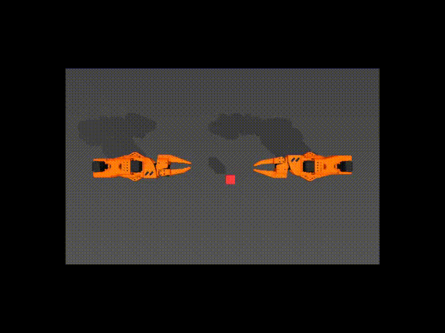

# gym-so100

A gym environment for [SO-ARM100](https://github.com/TheRobotStudio/SO-ARM100).




## Installation

Create a virtual environment with Python 3.10 and activate it, e.g. with [`miniconda`](https://docs.anaconda.com/free/miniconda/index.html):
```bash
conda create -y -n so100 python=3.10 && conda activate so100
```

Install gym-so100:
```bash
pip install -e .
```


## Quickstart

### 1. Check the environment

```python
# example.py
import imageio
import gymnasium as gym
import numpy as np
import gym_so100

env = gym.make("gym_so100/SO100Insertion-v0")
observation, info = env.reset()
frames = []

for _ in range(1000):
    action = env.action_space.sample()
    observation, reward, terminated, truncated, info = env.step(action)
    image = env.render()
    frames.append(image)

    if terminated or truncated:
        observation, info = env.reset()

env.close()
imageio.mimsave("example.mp4", np.stack(frames), fps=25)
```
### 2. Run the scripted sim task example

```bash
from gym_so100.policy import InsertionPolicy, PickAndTransferPolicy
from tests.test_policy import test_policy

test_policy("SO100EETransferCube-v0", PickAndTransferPolicy, True)
# test_policy("SO100EEInsertion-v0", InsertionPolicy, True)
```

## Description
SO100 *(aka. SO-ARM100)* environment.

Two tasks are available:
- TransferCubeTask: The right arm needs to first pick up the red cube lying on the table, then place it inside the gripper of the other arm.
- InsertionTask: The left and right arms need to pick up the socket and peg respectively, and then insert in mid-air so the peg touches the “pins” inside the socket.

### Action Space
The action space consists of continuous values for each arm and gripper, resulting in a 12-dimensional vector:
- Five values for each arm's joint positions (absolute values).
- One value for each gripper's position, normalized between 0 (closed) and 1 (open).

### Observation Space
Observations are provided as a dictionary with the following keys:

- `qpos` and `qvel`: Position and velocity data for the arms and grippers.
- `images`: Camera feeds from different angles.
- `env_state`: Additional environment state information, such as positions of the peg and sockets.

### Rewards
- TransferCubeTask:
    - 1 point for holding the box with the right gripper.
    - 2 points if the box is lifted with the right gripper.
    - 3 points for transferring the box to the left gripper.
    - 4 points for a successful transfer without touching the table.
- InsertionTask:
    - 1 point for touching both the peg and a socket with the grippers.
    - 2 points for grasping both without dropping them.
    - 3 points if the peg is aligned with and touching the socket.
    - 4 points for successful insertion of the peg into the socket.

### Success Criteria
Achieving the maximum reward of 4 points more than 10 times within last 50 steps.

### Starting State
The arms at home position and the items (block, peg, socket) start at a random position and angle.

### Arguments

```python
>>> import gymnasium as gym
>>> import gym_so100
>>> env = gym.make("gym_so100/SO100Insertion-v0", obs_type="pixels", render_mode="rgb_array")
>>> env
<TimeLimit<OrderEnforcing<PassiveEnvChecker<SO100Env<gym_so100/SO100Insertion-v0>>>>>
```

* `obs_type`: (str) The observation type. Can be either `pixels` or `pixels_agent_pos`. Default is `pixels`.

* `render_mode`: (str) The rendering mode. Only `rgb_array` is supported for now.

* `observation_width`: (int) The width of the observed image. Default is `640`.

* `observation_height`: (int) The height of the observed image. Default is `480`.

* `visualization_width`: (int) The width of the visualized image. Default is `640`.

* `visualization_height`: (int) The height of the visualized image. Default is `480`.


# LeRobot Dataset Creation

```bash
# 1. clone lerobot repo and install lerobot env, note: `pip install lerobot` do not include `LeRobotDataset` module
git clone https://github.com/huggingface/lerobot.git --single-branch
pip install -e .

# back to this repo and run the script to create dataset
# Note: update params to your own
python record_lerobot_dataset.py --user-id xuaner233 --root dataset --num-episodes 1
```


## Contribute

Instead of using `pip` directly, we use `poetry` for development purposes to easily track our dependencies.
If you don't have it already, follow the [instructions](https://python-poetry.org/docs/#installation) to install it.

Install the project with dev dependencies:
```bash
poetry install --all-extras
```


### Follow our style

```bash
# install pre-commit hooks
pre-commit install

# apply style and linter checks on staged files
pre-commit
```


## Acknowledgment

gym-so100 is adapted from [gym-aloha](https://github.com/huggingface/gym-aloha)
